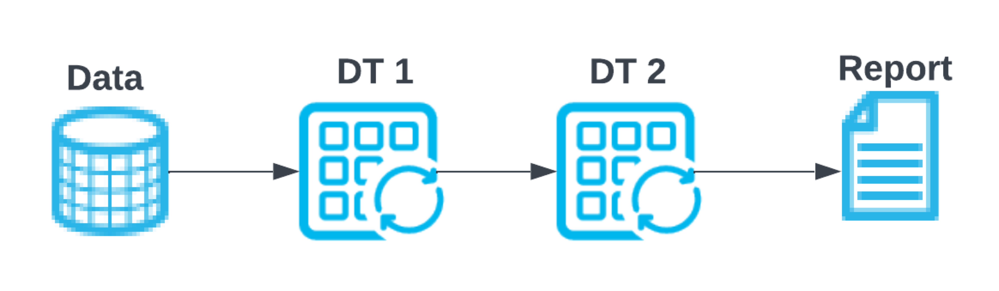
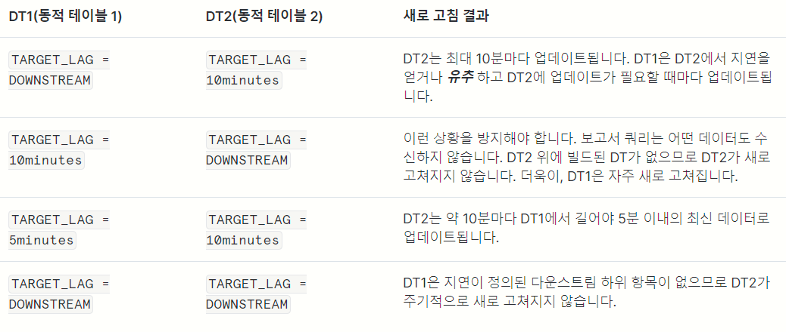

# 1. Dynamic Table


> **_<span style="background-color:yellow; color:red">Query Pipe(주기적으로 실행하는)가 설치된 Table</span>_**

> **Dynamic Table**은<br>`Source Table`에서 `Target Table`로 **데이터를 변환한 후 전달하는 상황**을 가정할 때,<br><br> **Dynamic Table**은 `일정 주기`로 `Source Table`을 감시하고, `Source Table`의 데이터가 변했을 때, <br>**Dynamic Table** `내부에 저장된 Query`를 실행하여<br> `Target Table` 즉, **Dynamic Table**에 `Query 결과값`을 `INSERT` OR `UPDATE` OR `DELETE`한다.

---

> **_Table인데,<br>특정 Query문을 가지며,<br>해당 Query는 Cron Job으로 동작하는<br>Data Pipeline이 달려있는 Table_**
> * **`Source Table`**을 `일정 주기`로 주시하면서,
>   * 데이터가 변했다면, **Query를 실행하여 기존 값을 새롭게 Update**
>   * 데이터가 변하지 않았다면, **아무 일도 일어나지 않는다.**

---

# 2. Materialized View와 비교

> **_Materialized View는 Query의 결과값을 물리 저장소에 저장하고 View 호출 시,<br> 즉각 데이터를 Query하는 `실체화된 View`이다._**
>
> * 얼핏 보면 `Dynamic Table`과 `Materialized View`는 동일한 기능을 하는 것처럼 보인다.
> * 실제로, 두 기능은 꽤 많이 유사하다.

## 2.1 유사점

* 두 기능 모두 <br>**사용자가 설정한 Query 결과를 저장하는 Table | View이며, 실제 저장소에 Query의 대한 결과값을 저장한다.**

* 두 기능 모두 <br>**실제로 Query를 수행하고 Query에 대한 결과값을 저장하므로, `데이터 저장 비용`과 `컴퓨팅 비용`이 청구된다.**

---

## 2.2 차이점

> **1. Query 주기**

* **Materialized View**는 `Source Table`에 변화가 일어나는 즉시, **View에도 변화가 일어난다.**
    * 즉, **항상 최신 상태, Real-Time에 준하다.**

* **Dynamic Table**은 `Dynamic Table`을 생성할 때, 설정한 **`Lag`**이라는 파라미터에 따릅니다.
    * **Lag**이란?
      * `CronJob`이라고 생각하면 된다.
      * `초`, `분`, `시`, `일`을 설정해서 주기적으로 Query를 실행하도록 설정한다.
      * 다만, 최소 주기는 **1분**이므로, `Materialized View`처럼 동작하진 못한다.

<br>

> **2. Query 복잡성**

* **Materialized View**는  단일 기본 테이블만 사용할 수 있습니다.
    * 즉, **복잡한 쿼리(즉, 조인 또는 중첩된 뷰가 있는 쿼리)를 기반으로 할 수 없습니다.**

* **Dynamic Table**은 조인과 유니온이 있는 쿼리를 포함한 복잡한 쿼리를 기반으로 할 수 있습니다.
    * 또한, **여러 Dynamic Table을 연결하여 복잡한 과정을 구축할 수 있습니다.**

<br>

> **3. 비용 관련**

* **특이사항으로, Dynamic Table은 Refresh Triggering을 위한 `클라우드 서비스 컴퓨팅 비용`이 청구됩니다.**
  * 일일 클라우드 서비스 비용이 계정의 일일 웨어하우스 비용의 10%보다 큰 경우에만 Snowflake가 요금을 청구하는 제약 조건을 따릅니다.

--- 

# 3. 생성 구문

```sql
CREATE [ OR REPLACE ] DYNAMIC TABLE <name>
  [ ( <column_list> ) ]
  TARGET_LAG = { '<num> { seconds | minutes | hours | days }' | DOWNSTREAM }
  WAREHOUSE = <warehouse_name>
  REFRESH_MODE = { AUTO | FULL | INCREMENTAL }
  INITIALIZE = { ON_CREATE | ON_SCHEDULE }
  AS <query>
  [ COMMENT = '<string_literal>' ]

-- Dynamic Table Example
CREATE OR REPLACE DYNAMIC TABLE DTableTest
  TARGET_LAG = '5 minutes'
  WAREHOUSE = COMPUTE_WH
  AS
    SELECT "id", "first_name" FROM S3TABLEEVOLVECSV;
```

---

## 3.1 Lag

> **콘텐츠가 기본 테이블에 대한 업데이트보다 지연되어야 하는 최대 시간을 지정**

>> `DOWNSTREAM`
>> * 어떤 동적 테이블에 종속된 동적 테이블을 새로 고칠 때만 해당 동적 테이블을 새로 고치도록 지정
>> * **즉, `두 개 이상의 Dynamic Table`에서, `하위 DT의 Lag`를 `확인` 또는 `유추`하여 업데이트한다는 것**





---

# 4. Examples

> **수행 결과, Dynamic Table이 생성 후, Source Table이 변화하더라도, 바로 Dynamic Table에 적용되지 않고 Lag에 설정된 주기 (5분)후에 적용됨을 확인했다.**

> **이와 반대로 Materialized View는 거의 실시간으로 적용됨을 확인했다.**

<details>
<summary>Dynamic Table</summary>
<div>

```sql
USE ROLE ACCOUNTADMIN;
USE DATABASE s3db;
USE SCHEMA s3db.public;

-- 원천(기본) 테이블 확인
-- 기존에는 id가 12까지 존재
SELECT S3TABLEEVOLVECSV."id" FROM S3TABLEEVOLVECSV;

-- Dynamic Table 생성
CREATE OR REPLACE DYNAMIC TABLE DTableTest
  TARGET_LAG = '5 minutes'
  WAREHOUSE = COMPUTE_WH
  AS
    SELECT "id", "first_name" FROM S3TABLEEVOLVECSV;

-- Dynamic Table의 데이터 확인
-- id가 12까지 존재
SELECT * FROM DTABLETEST;

-- 원천 테이블에 id = 13 인 데이터 삽입
INSERT INTO S3TABLEEVOLVECSV ("id", "first_name") VALUES (13, 'Jin');

-- 원천 테이블에 데이터 확인
SELECT * FROM S3TABLEEVOLVECSV;

-- Dynamic Table에 데이터 확인 1
  -- 바로 쿼리하면 아마 새로운 데이터 삽입 안되어있음
  -- 그 이유는 Lag에 1분이 경과되지 않아서 Update 안됨.
-- 1분 경과 후 쿼리 시, id = 13인 데이터 삽입된 것 확인
SELECT * FROM DTABLETEST;

-- 원천 테이블에 id = 13 데이터 삭제
DELETE FROM S3TABLEEVOLVECSV WHERE "id" = 13;

-- 원천 테이블에 데이터 확인
SELECT * FROM S3TABLEEVOLVECSV;

-- Dynamic Table에 데이터 확인 1
  -- 바로 쿼리하면 아마 새로운 데이터 삭제 안되어있음
  -- 그 이유는 Lag에 1분이 경과되지 않아서 Update 안됨.
-- 1분 경과 후 쿼리 시, id = 13인 데이터 삭제된 것 확인
SELECT * FROM DTABLETEST;


-- Dynamic Table 나열하고 세부 정보 보기
-- 여기서 REFRESH_MODE 열의 값 확인하면 `증분`인지 `전체` 새로고침인지 확인 가능
SHOW DYNAMIC TABLES LIKE 'DTABLETEST' IN SCHEMA S3DB.public;

-- Dynamic Table 일시 중지 및 재개
ALTER DYNAMIC TABLE DTABLETEST SUSPEND;
ALTER DYNAMIC TABLE DTABLETEST RESUME;

-- 수동 새로고침
ALTER DYNAMIC TABLE DTABLETEST REFRESH;

-- Lag 변경
ALTER DYNAMIC TABLE DTABLETEST SET TARGET_LAG = DOWNSTREAM;
```

</details>
</div>


<details>
<summary>Materialized View</summary>
<div>

```sql
USE ROLE ACCOUNTADMIN;
USE DATABASE s3db;
USE SCHEMA s3db.public;

-- 원천(기본) 테이블 확인
-- 기존에는 id가 12까지 존재
SELECT S3TABLEEVOLVECSV."id" FROM S3TABLEEVOLVECSV;

-- Materialized View 생성
CREATE MATERIALIZED VIEW S3MV
  AS
    SELECT "id", "first_name" FROM S3TABLEEVOLVECSV;

-- Materialized View의 데이터 확인
-- id가 12까지 존재
SELECT * FROM S3MV;

-- 원천 테이블에 id = 13 인 데이터 삽입
INSERT INTO S3TABLEEVOLVECSV ("id", "first_name") VALUES (13, 'Jin');

-- 원천 테이블에 데이터 확인
SELECT * FROM S3TABLEEVOLVECSV;

-- Dynamic Table에 데이터 확인 1
-- id = 13인 데이터 삽입된 것 확인
SELECT * FROM S3MV;

-- 원천 테이블에 id = 13 데이터 삭제
DELETE FROM S3TABLEEVOLVECSV WHERE "id" = 13;

-- 원천 테이블에 데이터 확인
SELECT * FROM S3TABLEEVOLVECSV;

-- Dynamic Table에 데이터 확인 2
-- id = 13인 데이터 삭제된 것 확인
SELECT * FROM S3MV;
```

</div>
</details>

---

